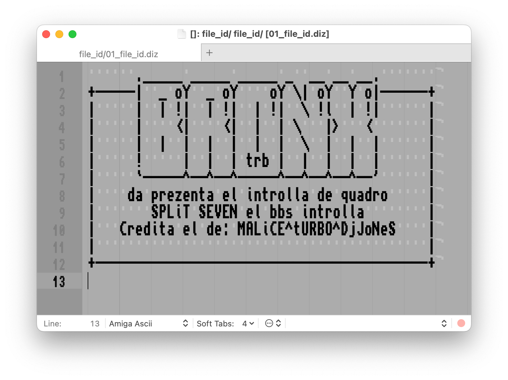
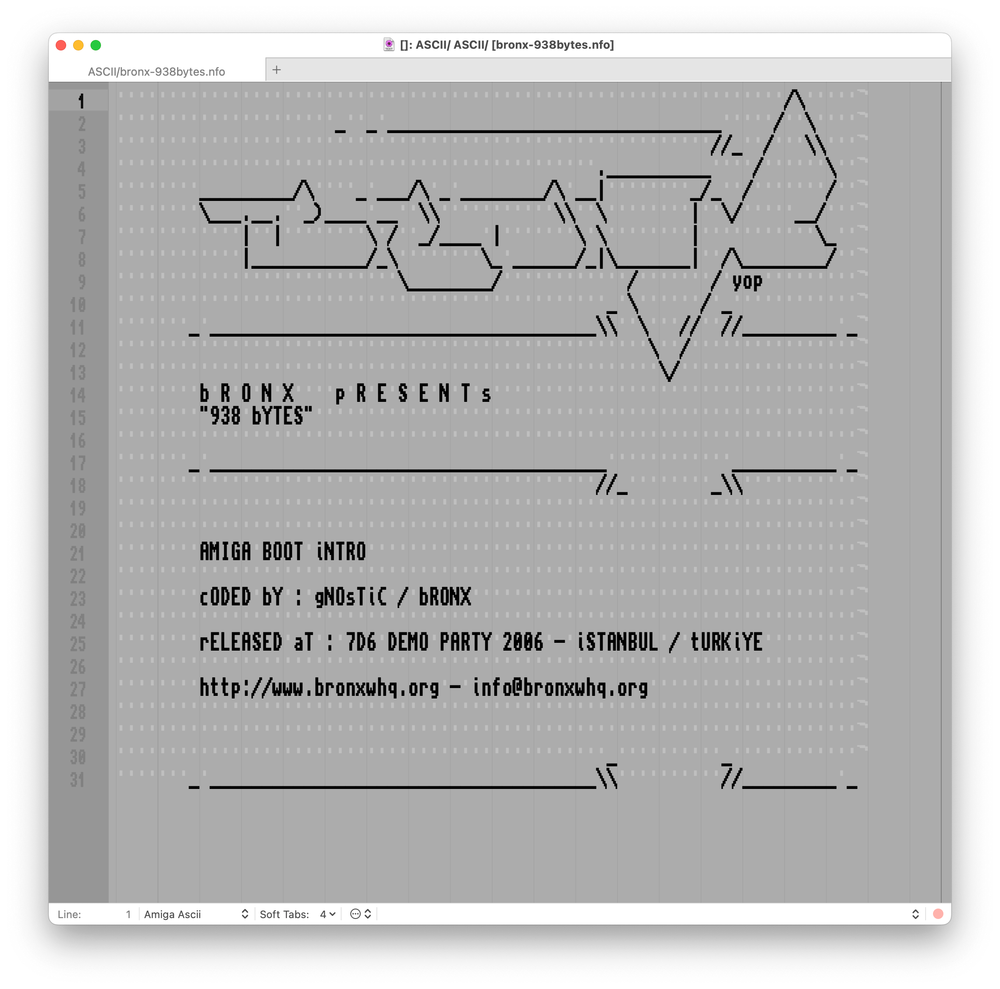

# Amiga Ascii Bundle for TextMate

If you are an oldskool amiga scener like me, you’ll love this bundle. Well,
yes, I know, TextMate is on the brink of the grave, I told you, I can't change
my habits easily :)



## Requirements

Download and install your fonts from: [amigafonts][01], use `ttf` files, copy
to `~/Library/Fonts/`. After choosing your font, please note the **PostScript
name** of the font! I use **Topaz**; `TopazPlusa600a1200a4000` is the
postscript name I need.

## Installation

```bash
cd ~/Library/Application\ Support/TextMate/Bundles/
git clone https://github.com/vigo/amiga-ascii.tmbundle.git 
```

Now, fix you `~/.tm_properties`, add lines below:

```ini
[ source.amiga.ascii ]
theme = 8C9B6D22-703E-4E6A-A244-326519A4B620
fontName = "TopazPlusa600a1200a4000"
softTabs         = true
```

Supported file extensions;

- `asci`
- `azki`
- `nfo`
- `info`
- `diz`

To activate/initiate, please click directly to any file with supported file
extensions. Loading new font sometimes takes few seconds for the first launch.

Now restart TextMate!



---

## Contribute

PR’s are very welcome!

1. `fork` (https://github.com/vigo/amiga-ascii.tmbundle/fork)
2. Create your `branch` (`git checkout -b my-feature`)
3. `commit` yours (`git commit -am 'add awesome feature'`)
4. `push` your `branch` (`git push origin my-feature`)
5. Than create a new **Pull Request**!

---

## Contributor(s)

* [Uğur "vigo" Özyılmazel][vigo] - Creator, maintainer

---

## License

This project is licensed under MIT.


[01]: https://github.com/rewtnull/amigafonts
[vigo]:  https://ugur.ozyilmazel.com "Official Homepage"
